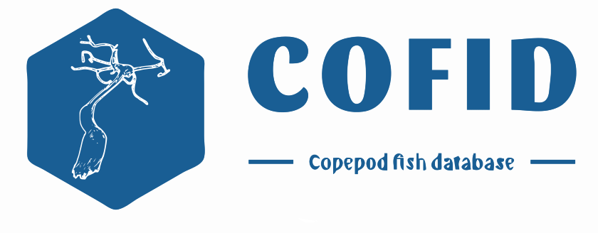

<!-- README.md is generated from README.Rmd. Please edit that file -->


<!-- badges: start --> <!-- badges: end -->

This R packages contains an expert curated Copepod Fish database. This
database was taxonomically curated by [Francisco Neptalí
Morales-Serna](https://orcid.org/0000-0002-2577-5369). The data
cleaning, standarization and wrapping as an R packages was done by
[Ángel Luis Robles-Fernandez](https://orcid.org/0000-0002-4674-4270)

## Installation

You can install the development version of cofid from
[GitHub](https://github.com/) with:

``` r
# install.packages("devtools")
devtools::install_github("alrobles/cofid")
# load the data to your environment
data(cofid, "cofid")
```

## Dataset

The dataset contains $7, 725$ copepod - fish interaction records. The
fields in the data set are:

- source_taxon_external_id: the id number provided by [World Register of
  Marine Species](https://www.marinespecies.org/)
- source_taxon_name: The scientific name of the copepod species
- source_taxon_path: Taxonomical hierarchy of the copepod. Only contains
  7 levels
- source_specimen_life_stage: The life stage of the record
- interaction_type: The type of interaction between copepod and fish The
  records are mainly ectoparasitic (7654). There are 74 endoparasitic
  and 7 parasitic
- target_taxon_external_id: The host fish id number provided by [World
  Register of Marine Species](https://www.marinespecies.org/)
- target_taxon_name: Host fish species scientific name
- target_taxon_path: Taxonomical hierarchy of the host fish. Only
  contains 7 levels
- target_specimen_life_stage: The life stage of the host fish
- study_citation: Original study where the record cand be found

## Online access

You can try online the dataset.

<iframe src="https://alroble8.shinyapps.io/cofid_app/" height="100%" width="100%" scrolling="yes" title="Iframe Example">
</iframe>
